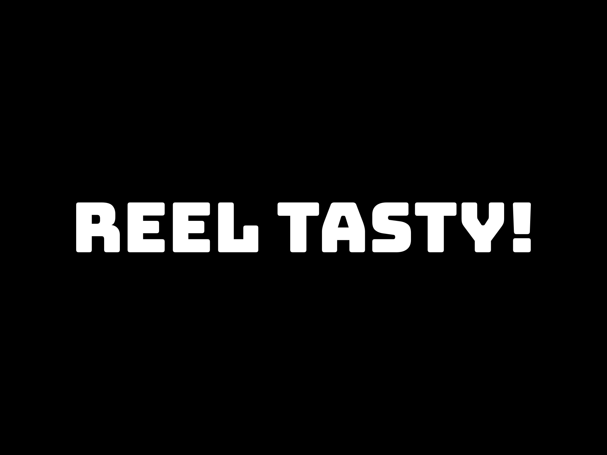

# 🍽️ Reel Tasty - Full-Stack Recipe Application

  

Welcome to **Reel Tasty** — a full-stack web application where users can submit TikTok videos, transcribe the audio, and generate recipes with the help of OpenAI's ChatGPT. Discover trending foods, save your favorite recipes, and get personalized cooking tips all in one place!

Try it out! [www.reeltasty.com](https://www.thereeltasty.com/)

## 🚀 Features

- **Video Submission & Recipe Generation**: Submit TikTok video links, transcribe the audio with OpenAI's Whisper, and let ChatGPT generate a detailed recipe based on the transcription.
- **ChatGPT Interaction**: Ask follow-up questions or get personalized cooking tips directly on the page alongside the recipe.
- **Trending Foods**: Stay updated with the latest food trends from TikTok on the trending foods page.
- **Your Recipes**: Save and access your favorite recipes and view recently seen recipes for quick reference.

## 🛠️ Technologies Used

- **Frontend**: [Next.js](https://nextjs.org/), [Tailwind CSS](https://tailwindcss.com/)
- **Backend**: [ASP.NET Core](https://dotnet.microsoft.com/apps/aspnet), [PostgreSQL](https://www.postgresql.org/)
- **Cloud Services**: 
  - [AWS S3](https://aws.amazon.com/s3/) (for video storage)
  - [Elastic Beanstalk](https://aws.amazon.com/elasticbeanstalk/) (for backend deployment)
  - [AWS Amplify](https://aws.amazon.com/amplify/) (for frontend deployment)
  - [AWS RDS](https://aws.amazon.com/rds/) (for PostgreSQL database hosting)
- **API Integrations**: [TikAPI](https://tikapi.io/) (fetch TikTok content), [OpenAI Whisper](https://openai.com/research/whisper) (for audio transcription), [OpenAI ChatGPT](https://openai.com/chatgpt) (for recipe generation)
- **Node.js**: Handles transcriptions and ChatGPT queries.

## 🏗️ Architecture

Reel Tasty is built with a modern, scalable architecture:

- **Frontend**: Deployed on AWS Amplify, providing a responsive and dynamic user interface built with Next.js and styled using Tailwind CSS.
- **Backend**: Powered by ASP.NET Core, the backend is responsible for handling video submissions and API calls, while transcriptions and ChatGPT queries are processed using Node.js, and the backend is deployed on Elastic Beanstalk.
- **Database**: PostgreSQL is used to store user data, video details, recipes, and transcriptions, hosted on AWS RDS for reliability and scalability.
- **API Integration**: The backend integrates with external APIs like TikAPI for fetching TikTok content, AWS S3 for storing video files, and OpenAI for transcription and recipe generation.

## 🚀 Deployment

- **AWS S3**: Stores the video files securely.
- **Elastic Beanstalk**: Hosts the backend services.
- **AWS RDS**: Stores user data, transcriptions, and recipes.
- **AWS Amplify**: Hosts the Next.js frontend, providing seamless integration and scalability for the user interface.
